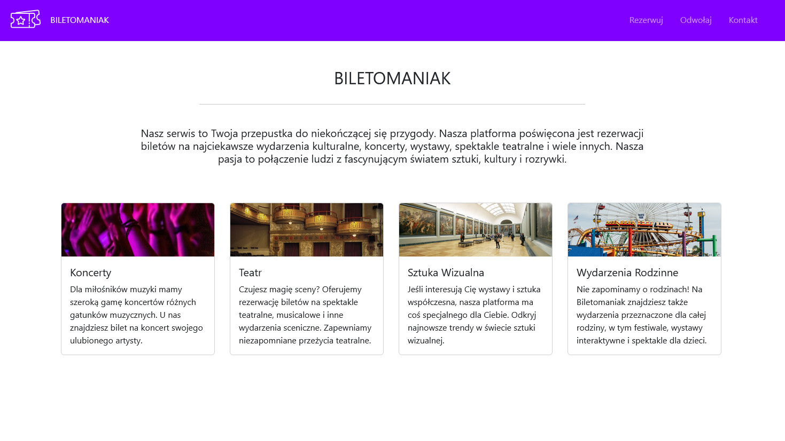

# Biletomaniak

     

[](https://github.com/f4rys/Biletomaniak/actions/workflows/angular.yml) [](https://github.com/f4rys/Biletomaniak/actions/workflows/codeql.yml) [](https://github.com/f4rys/Biletomaniak/actions/workflows/firebase-deploy.yml) 

Project for the subject of Programming Workshop V built with Angular and Firebase. It provides a simple skeleton of a reservation management system with the following core features:

* **Reservation Creation:**  Users can easily book reservations.
* **Reservation Cancellation:** Users can cancel existing reservations.
* **Contact Form:** A simple way for users to send messages or inquiries.

The backend leverages Firebase's Firestore database for real-time data storage and management. Firebase Hosting is used to host the project.

**A Friendly Note:**

This project is for learning purposes and contains Firebase secrets (like API keys) that are meant to be kept private. Please be kind and avoid using these secrets for anything other than exploring the project's code. Using them in a real-world context could potentially cause issues with my Firebase project.

</br>



## Tech Stack

* **Frontend:** Angular, TypeScript, HTML, Sass
* **Backend:** Firebase
* **Styling:** Bootstrap

## Run locally

1. **Clone the Repository:**
   ```bash
   git clone https://github.com/f4rys/Biletomaniak

2. **Install dependencies and run:**
   ```bash
   npm install
   npm run start
4. **Open in browser:**
   ```bash
   http://localhost:4200/

## Credits
<div>• Logo by <a href="https://www.flaticon.com/authors/freepik">Freepik</a> on <a href="https://www.flaticon.com/free-icon/ticket_1061702">Flaticon</a></div>
<div>• Amusement park photo by <a href="https://www.pexels.com/@rickyrecap/">Ricky Esquivel</a> on <a href="https://www.pexels.com/photo/photo-of-ferris-wheel-during-daytime-2974664/">Pexels</a></div>
<div>• Theatre photo by <a href="https://www.pexels.com/@pixabay/">Pixabay</a> on <a href="https://www.pexels.com/photo/gray-theater-seat-63328/">Pexels</a></div>
<div>• Crowd photo by <a href="https://www.pexels.com/@felipebalduino/">Felipe Balduino</a> on <a href="https://www.pexels.com/photo/crowd-raising-their-hands-2842763/">Pexels</a></div>
<div>• Exhibit photo by <a href="https://www.pexels.com/@riciardus/">Riccardo</a> on <a href="https://www.pexels.com/photo/exhibit-painting-display-69903/">Pexels</a></div>
